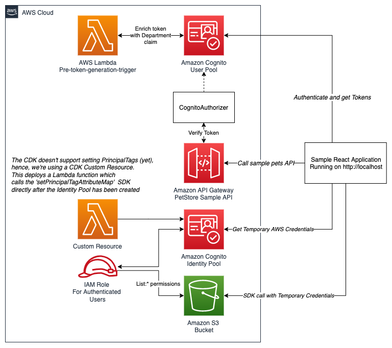
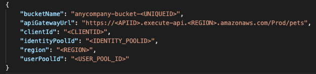
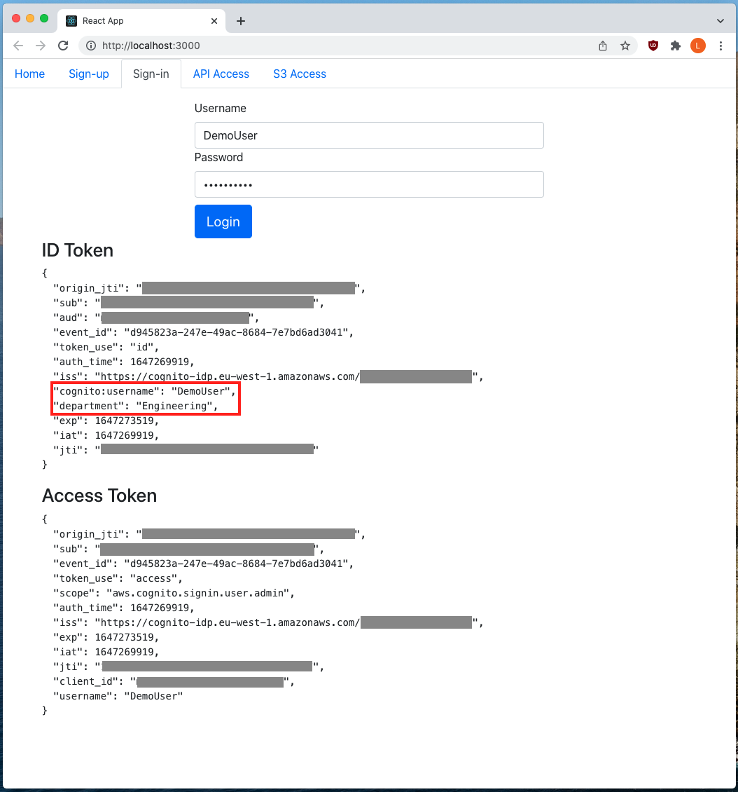
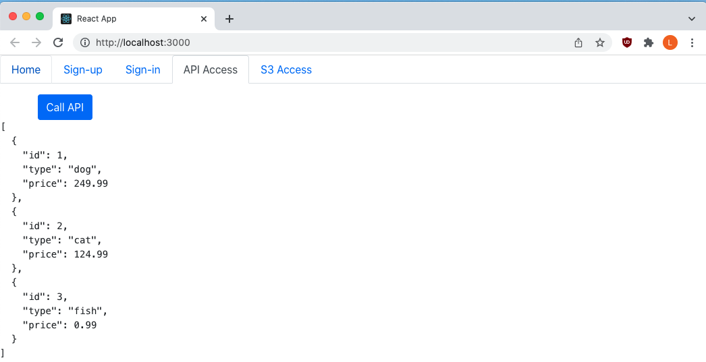
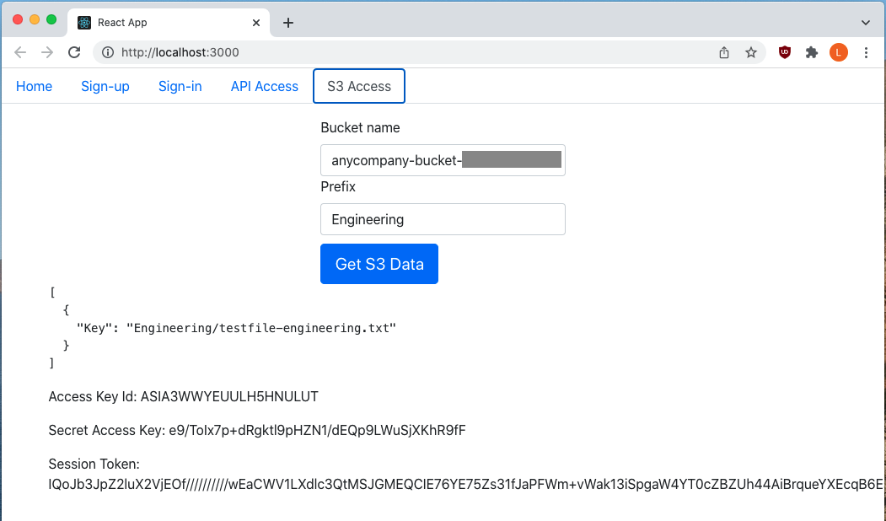
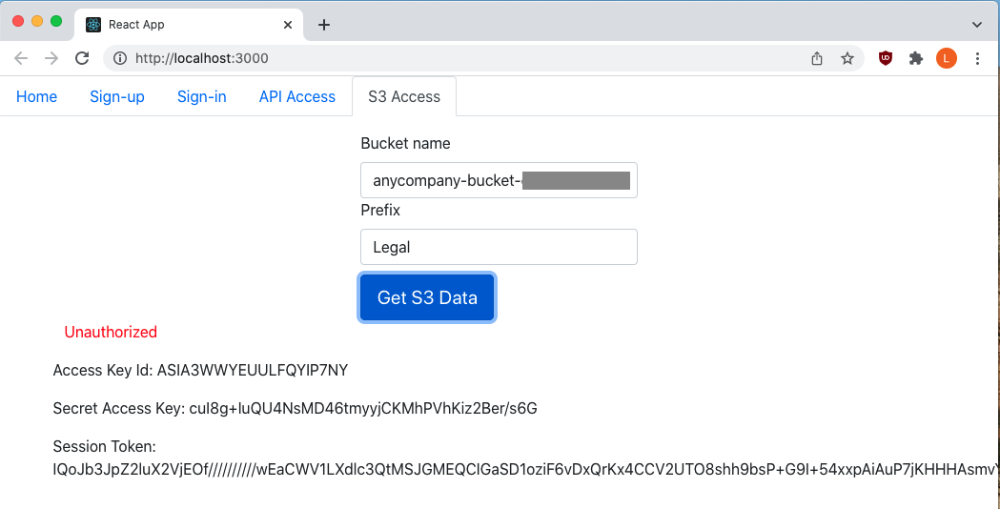

# Sample React App Using ABAC + Identity Pools to access AWS resources 

Project: amazon-cognito-abac-authorization-with-react-sample

This open-source repository consists of two main items:
* A CDK Script which deploys the backend resources required to demonstrate Attribute Based Access Control (ABAC) using Cognito
* A sample React Application which uses Cognito for authentication and Authorization to AWS resources (using ABAC)

## DISCLAIMER
The sample code; software libraries; command line tools; proofs of concept; templates; or other related technology (including any of the foregoing that are provided by our personnel) is provided to you as AWS Content under the AWS Customer Agreement, or the relevant written agreement between you and AWS (whichever applies). You should not use this AWS Content in your production accounts, or on production or other critical data. You are responsible for testing, securing, and optimizing the AWS Content, such as sample code, as appropriate for production grade use based on your specific quality control practices and standards. Deploying AWS Content may incur AWS charges for creating or using AWS chargeable resources, such as running Amazon EC2 instances or using Amazon S3 storage. 

## Deploy backend resources
This CDK script will deploy the following resources:


(Not depicted - the Cognito Identity Pool uses the Cognito User pool as authentication provider)

Step 1: Bootstrap the CDK project
```sh
cdk bootstrap
```

Step 2: Deploy the CDK project
```sh
cdk deploy
```

Step 3: Wait for the deployment to finish, and don't clear the outputs as this will make the next step easier.

## Run Sample React app
### Pre-requisites
Run the CDK commands above to deploy the following resources in your account:
1. **Cognito User Pool** - used for authentication of users
2. **Cognito App Client** - used by the React application to interact with the User Pool
3. **Cognito Identity Pool** - used to get temporary AWS credentials. The CDK script will create the Identity Pool and use the User Pool as authentication provider. It will also create custom mappings to map the 'department' claim from the user-token to the 'department' Principal Tag, which is used for authorization to resources.
4. **Lambda pre-token-generation function** - augments the user token returned by Cognito with a 'department' claim (currently hardcoded to "Engineering" for this demo) 
5. **S3 Bucket** - S3 bucket to demonstrate ABAC to AWS resources. In particular, authorization to S3 resources based on claims from the token. The CDK script adds a .zip file under the "Engineering" and "Legal" prefixes. 
6. **Sample API Gateway** - Additional demo to show Authentication and Authorization to an API resource (not using ABAC)

### Setup the Configuration file
Once deployed, go to `react-sample/src/configuration.json` and add the relevant inputs required to run the application. For your convenience, we've added the relevant parameters which you need for the configuration file as outputs from the CDK deployment:


Add the relevant outputs to the configuration file:


### Create a test user
In order to test the application, you will need a test-user in your Cognito User Pool. You can create a user by going to the User Pool directly in the AWS Console or you can run the following two CLI commands (which requires AWS credentials with the right permissions):
```shell
aws cognito-idp admin-create-user --user-pool-id <your_user_pool_id> --username <your_user_id>
```
```shell
aws cognito-idp admin-set-user-password --user-pool-id <your_user_pool_id> --username <your_user_id> --password <your_password> --permanent
``` 
### Start the Web-server locally
Go to the react-sample directory
```sh
cd react-sample
```

In the main directory of the application run the following:

```sh
npm install
```

After the dependencies have been installed, run the following to start a local server:

```sh
npm start
```

You should now be able to go to `http://localhost:3000` to view your web-page. You can log in using the test-user credentials created in the Section above. 

### Screenshots
* Login page, using the test user created previously. This will output the ID token and Access token. Notice that the department claim has been added automatically.


* API example - which uses a Cognito Authorizer to validate the token passed into the request. 


* S3 ABAC example, when requesting S3 data for the Engineering prefix, the sample ZIP will be listed. It will also display the temporary credentials used for the AWS request.


* S3 ABAC example, when requesting S3 data for the Legal prefix, the sample ZIP will **not** be listed because the token does not have the 'Legal' department claim. It will also display the temporary credentials used for the AWS request, but the response is an Unauthorized error.



## Important notes
* This is a demonstration application, and should not be used for production applications
* We do not store your user tokens in LocalStorage or Session Cookies, therefore, whenever the web-page is refreshed, you will have to re-authenticate. Moving between the different pages in the navigation bar is fine.
* We print the AWS credentials on the S3 Access Tab to showcase refreshing AWS credentials. However, if these credentials were to be leaked, users can call AWS resources with the attached permissions. Currently, the role is scoped down to only allow List* access to the sample S3 files, but make sure to be careful with this mechanism. And again, don't use this for production systems.
* When running `npm install` you might get a '6 moderate vulnerabilities found' output. See [this issue](https://github.com/facebook/create-react-app/issues/11174) for more details.
* If you are using AWS Cloud9 to run the sample application, you can change the start script in the `react-sample/package.json` to include the following to change the preview port to 8080: `"start": "PORT=8080 react-scripts start"` 
  
## Cleaning up
Run the following command:
```sh
cdk destroy
```

Or go to Cloudformation service in your console and delete the deployed stack manually.

**Important** The following resources will not automatically delete:
* The CognitoUser Pool
* The S3 bucket

Due to the fact that these two resources may contain data / objects you might want to keep, cdk destroy doesn't automatically delete them. You can still delete both resources manually if you wish.

## Security

See [CONTRIBUTING](CONTRIBUTING.md#security-issue-notifications) for more information.

## License

This library is licensed under the MIT-0 License. See the LICENSE file.
